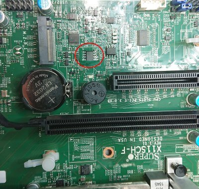

# Supermicro X11SCH-F

This section details how to run coreboot on the [Supermicro X11SCH-F].

## Flashing coreboot

The board can be flashed externally using *some* programmers. CH341A was found to be working,
whereas a Dediprog didn't detect the chip.

The flash IC can be found between the two PCIe slots near the southbridge:


## BMC (IPMI)

This board has an ASPEED [AST2500] BMC, which has [IPMI] functionality. The BMC firmware resides
in a 32 MiB SOIC-16 flash chip in the corner of the mainboard near the [AST2500]. This chip is
a [Macronix MX25L25635F].

## Tested and working

- USB ports
- Ethernet
- SATA ports
- RS232 external
- ECC DRAM detection and initialisation
- PCIe slots
- M.2 2280 NVMe slot
- BMC (IPMI)
- VGA and iKVM on Aspeed BMC
- TPM on TPM expansion header
- TPM support (w/ patched IFD) - Patch IFD at 0x235=03 and 0x13E=84

## Not working
 - BMC UI sensor readings - this is probably due to the missing "POST complete" gpio code.
   See x11ssm-f for an example. One would need to identify which pin is connected there.

## To do

- Fix FIXMEs and TODOs in code

## Technology

```eval_rst
+------------------+--------------------------------------------------+
| CPU              | Intel Coffee Lake                                |
+------------------+--------------------------------------------------+
| PCH              | Intel C246                                       |
+------------------+--------------------------------------------------+
| Coprocessor      | Intel SPS (server version of the ME)             |
+------------------+--------------------------------------------------+
| Super I/O        | ASPEED AST2500                                   |
+------------------+--------------------------------------------------+
| Ethernet         | 2x Intel Gigabit Ethernet                        |
|                  | 1x dedicated BMC                                 |
+------------------+--------------------------------------------------+
| PCIe slots       | 1x 3.0 x8 (in x16)                               |
|                  | 1x 3.0 x8                                        |
|                  | 2x 3.0 M.2 2260/22110 x4 (Key M)                 |
+------------------+--------------------------------------------------+
| USB ports        | 2x USB 2.0 (ext)                                 |
|                  | 2x USB 3.0 (ext)                                 |
|                  | 1x USB 3.0 (int)                                 |
|                  | 1x dual USB 3.0 header                           |
|                  | 2x dual USB 2.0 header                           |
+------------------+--------------------------------------------------+
| SATA ports       | 8x SATA III                                      |
+------------------+--------------------------------------------------+
| Other connectors | 1x RS232 (ext)                                   |
|                  | 1x RS232 header                                  |
|                  | 1x TPM header                                    |
|                  | 1x Power SMB header                              |
|                  | 6x PWM Fan connector                             |
|                  | 2x I-SGPIO                                       |
|                  | 2x S-ATA DOM Power connector                     |
|                  | 1x XDP Port                                      |
|                  | 1x External BMC I2C Header (for IPMI card)       |
|                  | 1x Chassis Intrusion Header                      |
+------------------+--------------------------------------------------+
```

## Extra links

- [Supermicro X11SCH-F]
- [Board manual]

[Supermicro X11SCH-F]: https://www.supermicro.com/en/products/motherboard/X11SCH-F
[Board manual]: https://www.supermicro.com/manuals/motherboard/X11/MNL-2105.pdf
[AST2500]: https://www.aspeedtech.com/products.php?fPath=20&rId=376
[IPMI]: ../../../../drivers/ipmi_kcs.md
[Macronix MX25L25635F]: https://media.digikey.com/pdf/Data%20Sheets/Macronix/MX25L25635F.pdf
